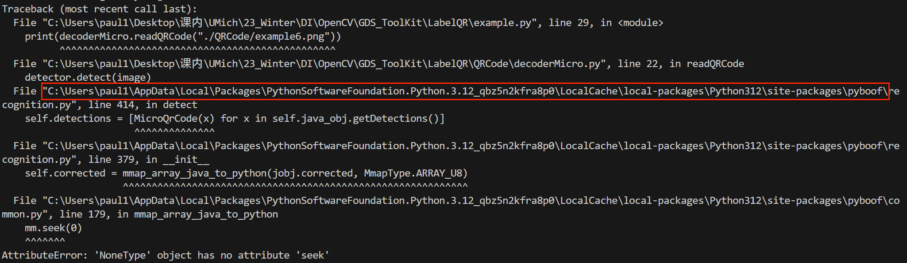

# GDS_ToolKit

## LabelQR
a extended Toolkit for Nazca:
* Standard QRCode:
    * Encoder: Generate label text with its corresponding Standard QRCode. Return a Cell with text polygons and QRCode polygons
    * Decoder: Use several different method to detect texts from QRCodes in the specified image; Support both Microscope View and Klayout View
* Micro QRCode:
    * Encoder: Generate label text with its corresponding Micro QRCode. Return a Cell with text polygons and QRCode polygons
    * Decoder: Only support Microscope View

Usage:
* Download LabelQR folder (you may git clone the repo or download repo zip [click green Code button, there will be a download zip button])
* You can use ```pip install requirements.txt``` to install all dependency for using this ToolKit (except ```nazca```, please follow [nazca download](https://nazca-design.org/installation/) to install ```nazca```)
* For ```decodeMicro```, if you encounter this kind of error:
  * 
  * [Official Github Repo Corresponding Issue Link](https://github.com/lessthanoptimal/PyBoof/issues/27)
  * This can be fixed by modifying the ```__init__.py``` file in the ```<python_environment_location>/site-packages/pyboof folder```, (the ```<python_environment_location>/site-packages/pyboof folder``` is like the path I boxed, you can copy from your error message). On line 160, change mmap_file to pbg.mmap_file like so:
    ```python
    pbg.mmap_file = mmap.mmap(pbg.mmap_fid.fileno(), length=0)
    ```

## Code
Other code made previously
